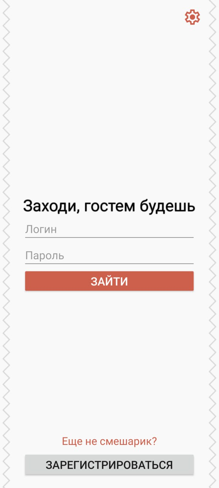
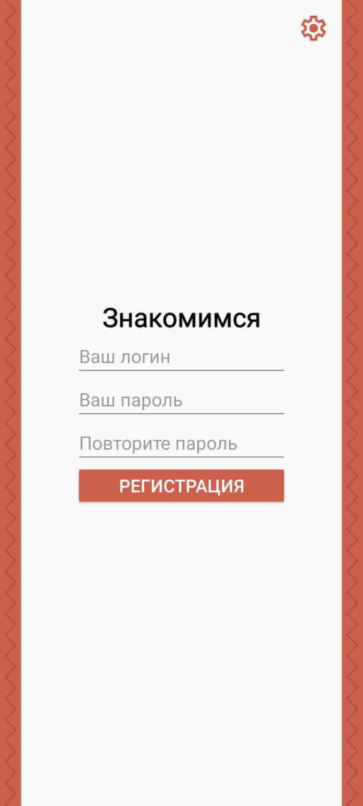
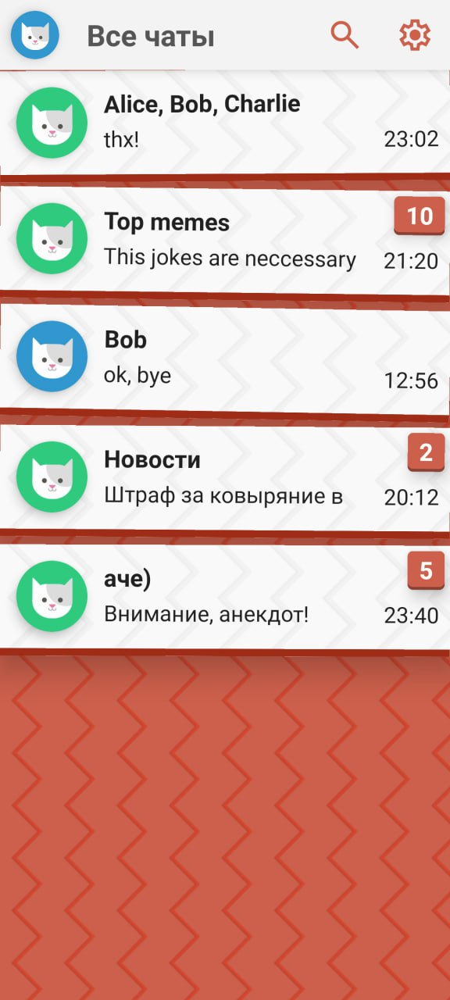
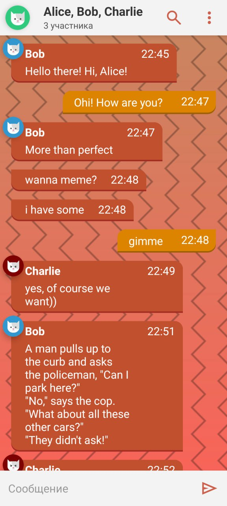
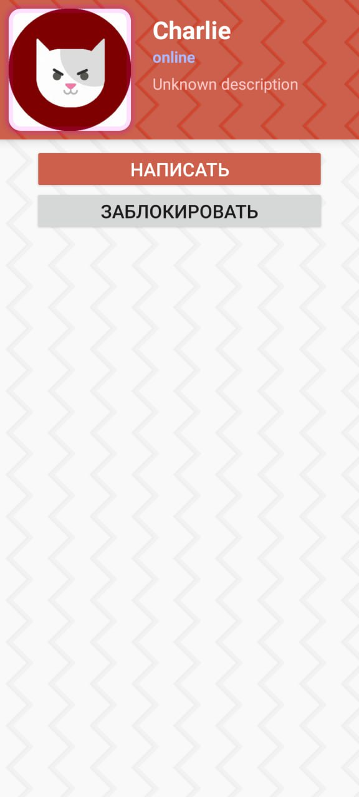
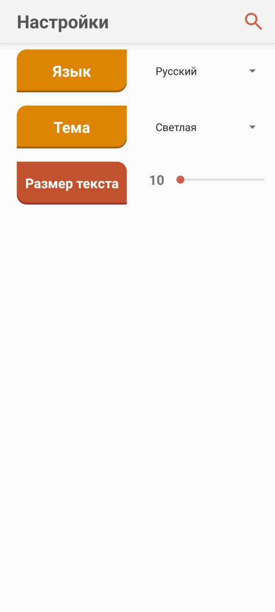

# ChatApp
Это I этап проекта по созданию чат-приложения на Android. Имеется 6 экранов. Они реализованы как фрагменты внутри одного контейнера.

Далее пройдемся по всей навигации.
## 1. Auth Login Fragment

Это первый экран, который встречает пользователя. 

Поскольку еще нет сервера, сессии не реализованы, и данный экран появляется всегда.

- В правом верхнем углу назодится кнопка настроек приложения, ведущая на соответствующий экран.
- Вы можете ввести логин и пароль и нажать кнопу "ВОЙТИ", если логи или пароль не совпадает,
аутентификация не сработает, предупреждение об ошибке в данных не реализовано.
- В отсутствие базы данных проверка на корректность ведется вручную в OnClickListener.

Логин: **'nickname'**

Пароль: **'password'**

- Внизу находится кнопка, открывающая экран регистрации. Вы можете вернуться из него обратно.

## 2. SignUp Fragment

Открывается из 1 экрана. В отсутствие базы данных системы регистрации нет, и экран является заглушкой. Любые вводимые данные допустимы для регистрации.

**Но поля для пароля и его подтверждения должны совпадать**

В правом верхнем углу имеется кнопка настроек.

## 3. Chat List Fragment
После регистрации или ввода создается фрагмент со списком чатов. 

- В отсутствие базы данных список чатов прописан вручную при создании фрагмента, используется RecyclerView.
- Элементом RecyclerView является layout [Chat Card](https://github.com/KIrillPal/ChatApp/blob/app/app/src/main/res/layout/chat_card.xml).
  Карточка чата создается со следующими аргументами
  1. val chatName: String, - название чата
  2. val lastMessage: String, - отображаемое последнее сообщение
  3. val lastMessageTime: Long, - время его отправки
  4. val unreadMessageCnt: Int, - количество непрочитанных. оно отображается оранжевой кнопкой в правом углу карточки.
  5. val chatIconId: Int?, - иконка чата
  6. val descr: String = "" - описание чата для его открытия, это костыль. По хорошему, оно должно подгружаться из БД.

- Верхняя навигационная панель содержит иконку профиля нашего пользователя, кнопку поиска чатов и кнопку настроек приложения. Поведение реализовано только для последней.
- Иконка профиля нереализована (в отличие от карточек чатов и профилей других пользователей), т.к. данный экран еще нужно будет реализовать, он также тесно связан с базой данных.
- Каждая карточка чата кликабельна, создается и отображается соответсвующий экран чата. Из него можно вернуться.
- Кстати, экраны 1 и 2 после успешного входа не кладутся в BackStack, к ним вернуться нельзя.

## 4. Chat Fragment
После нажатия на карточку чата создается его фрагмент. В отсутствие базы данных необходимая информация о названии, иконке и описании чата подгружается из карточки чата. 
Однако сообщения написаны вручную при создании фрагмента, добавляются через RecyclerView.

- Вы можете кликнуть на любую из иконок и попасть на экран профиля этого человека или чата. Для профилей пользователя указывается его статус, для чата количество участников.
- На верхней панели имеется кликабельная иконка чата, кнопка поиска (не реализована) и троеточие(пустое пока),
- Внизу есть поле для отправки сообщений, пока не реализовано в отсутстиве БД.
- В RecyclerView лежат сообщения двух типов: наши и чужие сообщения. Они отличаются по layout и имеют одинаковый интерфейс создания.

## 5. Profile Fragment
Данный фрагмент нужен для взаимодействия с профилями других пользователей или чатами.

1. Конпка 'НАПИСАТЬ' реализована и открывает чат с этим пользователем или чатом, однако не подгружается описание, т.к. нет БД и не хочется пробрасывать его так далеко аргументами.
Вы можете вернуться из этого чата в профиль.
2. Кнопка 'ЗАБЛОКИРОВАТЬ' не реализована в отсутствие БД.

## 6. Settings Fragment
Данный фрагмент открывается из экранов 1, 2 и 3 и содержит базовые настройки интерфейса.

- Можно выбрать светлую или темную тему, язык, а так же размер шрифта названий, настроек и сообщений. Ползунок работает.
- Данные настройки пока не применяются в приложении, они будут реализованы в самом конце проекта.
- Имеется кнопка поиска настроек на случай расширения списка настроек.
